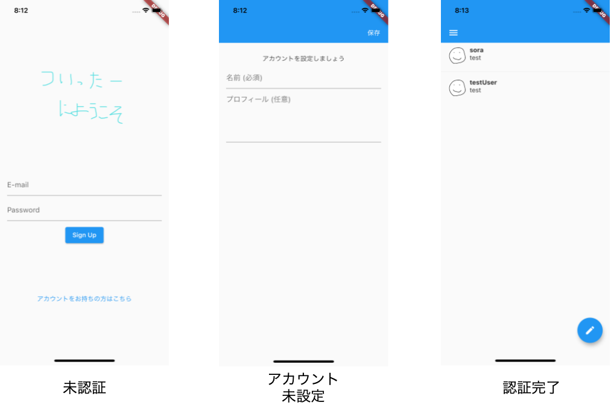

# twitter_clone
Flutter/Firebaseで作成中のツイッターライクなアプリケーションです。

## アプリの機能
### 認証系
認証にはFirebase Authのemail&password認証を使用しています。
本アプリでは認証の状態は未認証・アカウント未情報設定・認証完了の３状態があり、それぞれログイン画面・プロフィール設定画面・ホーム画面にルーティングされるようになっています。

### タイムラインとツイート
本アプリにはフォロー機能がないため, タイムラインにはすべてのユーザーのすべての投稿が閲覧可能になっています。
FloatingActionButtonを押下すると、ツイート編集用のモーダルが表示され、ツイートできます。

## 制作期間
最低限の認証とツイート機能は２日間かけて12時間ぐらいで作成しました。